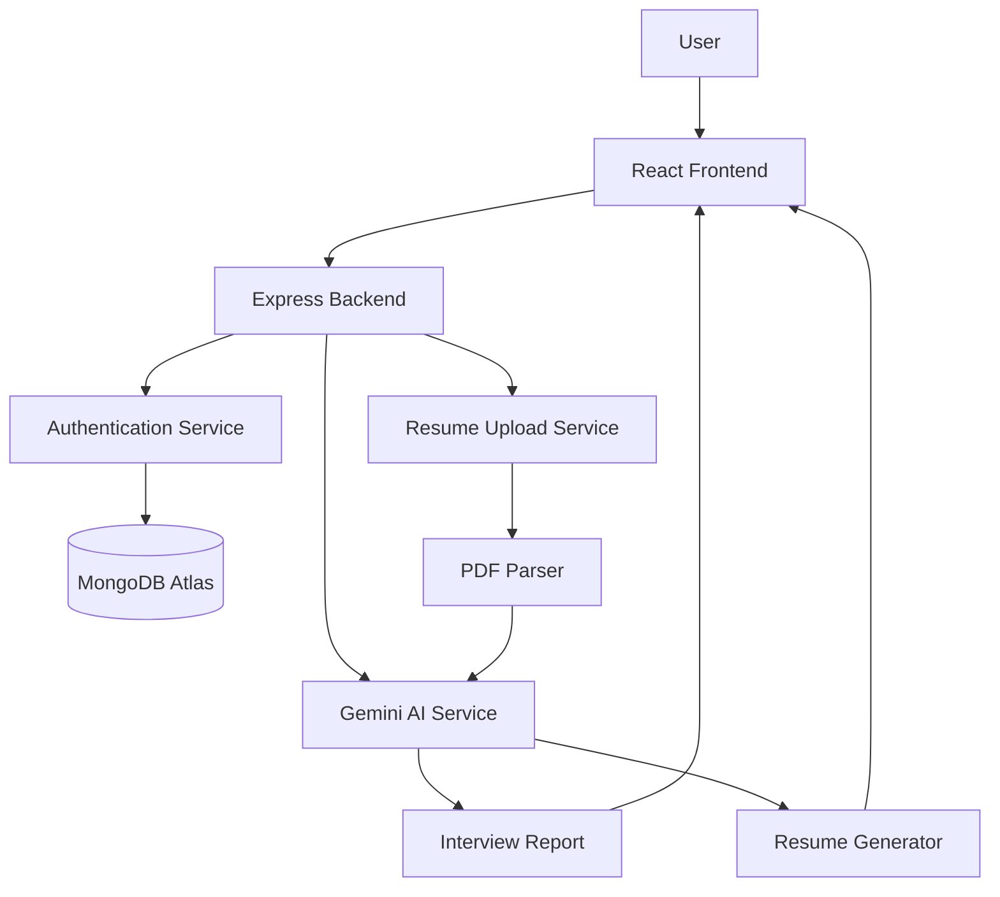
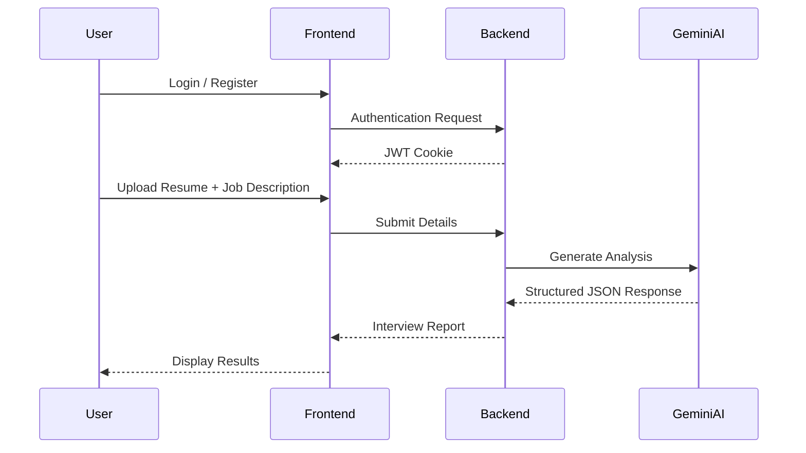
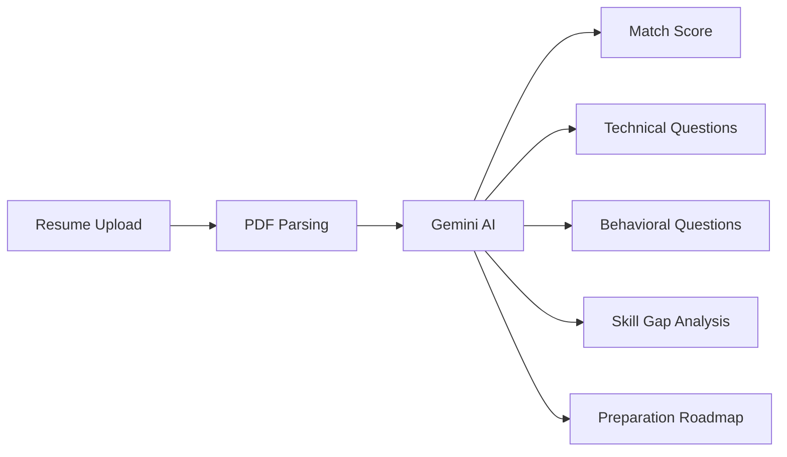

# Interview AI 🚀

AI-powered interview preparation platform built using the MERN stack and Google Gemini AI. The application analyzes resumes and job descriptions to generate personalized interview strategies, technical and behavioral questions, skill-gap analysis, and preparation roadmaps.

## Live Demo

**Frontend:** https://ai-interview-preparation-dun.vercel.app/

**Backend API:** https://ai-interview-preparation-9hka.onrender.com/

---

## Features

* 🔐 User Authentication (JWT + Cookies)
* 📄 Resume Upload & PDF Parsing
* 🤖 AI-Powered Interview Analysis
* 💻 Technical Interview Questions & Answers
* 🗣️ Behavioral Interview Questions & Answers
* 📊 Match Score Calculation
* 🎯 Skill Gap Analysis
* 📅 Personalized Preparation Plan
* 📑 AI-Generated ATS-Friendly Resume PDF
* 🔒 Protected Routes & Session Management

---

## Tech Stack

### Frontend

* React 19
* Vite
* React Router DOM
* Axios
* Sass

### Backend

* Node.js
* Express.js
* MongoDB Atlas
* Mongoose
* JWT Authentication
* Multer
* Puppeteer
* Google Gemini AI
* Zod

---

## Architecture



---

## Project Structure

```text
AI_interview_preparation/
│
├── Frontend/
│   ├── src/
│   │   ├── features/
│   │   │   ├── auth/
│   │   │   └── interview/
│   │   ├── App.jsx
│   │   └── main.jsx
│   └── package.json
│
├── Backend/
│   ├── src/
│   │   ├── config/
│   │   ├── controllers/
│   │   ├── middlewares/
│   │   ├── models/
│   │   ├── routes/
│   │   └── services/
│   ├── server.js
│   └── package.json
│
└── README.md
```

---

## Workflow



---

## Environment Variables

### Backend (.env)

```env
PORT=3000

MONGO_URI=your_mongodb_connection_string

JWT_SECRET=your_secret_key

GOOGLE_GENAI_API_KEY=your_google_gemini_api_key
```

---

## Installation

### Clone Repository

```bash
git clone https://github.com/SATYA-916/AI_interview_preparation.git

cd AI_interview_preparation
```

### Backend Setup

```bash
cd Backend

npm install

npm run dev
```

### Frontend Setup

```bash
cd Frontend

npm install

npm run dev
```

---

## API Flow



---

## AI Output

The application generates:

* Match Score (0-100)
* Technical Interview Questions
* Behavioral Interview Questions
* Skill Gap Analysis
* Personalized Preparation Roadmap
* ATS-Friendly Resume PDF

---

## Deployment

### Frontend

* Vercel

### Backend

* Render

### Database

* MongoDB Atlas

---

## Known Limitation

The current implementation uses cookie-based authentication between different domains (Vercel and Render). Some browsers that block third-party cookies may require users to allow third-party cookies for authentication to work correctly.

---

## Future Improvements

* AI Voice Mock Interviews
* Real-Time Interview Simulation
* Company-Specific Interview Preparation
* Interview Performance Analytics
* AI Feedback Dashboard
* OAuth Login (Google/GitHub)
* JWT Bearer Authentication

---

## License

MIT License

---

### Author

**Satya**
MERN Stack Developer | AI Enthusiast
